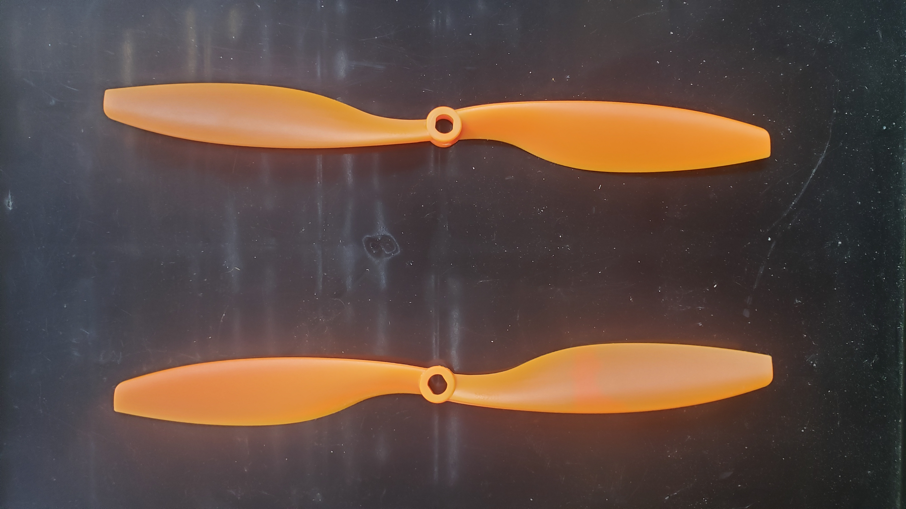
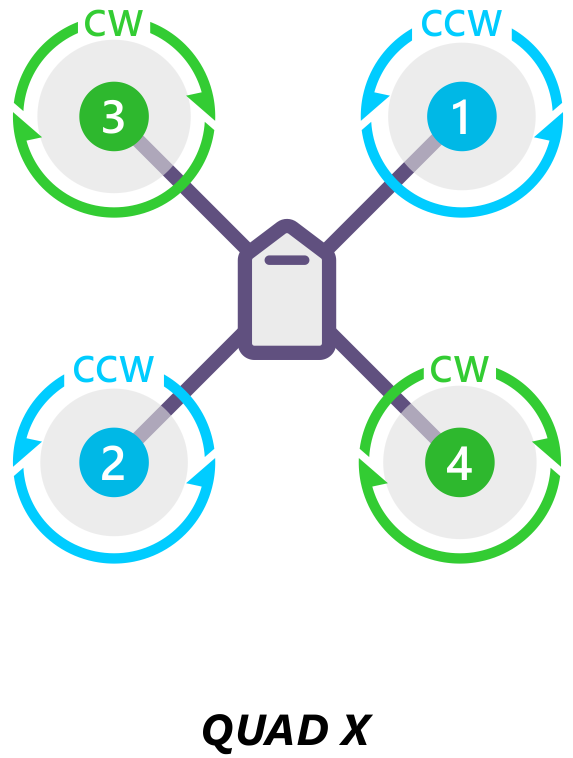

# Copter

### Propeller Direction of Rotation

Reference to a multi copter with propellers mounted above the motor - When looking from above a drone at your feet:  

|  |  |

- A Reverse (R) propeller should rotate clockwise (pusher)
- A Normal (N) propeller should rotate counterclockwise.
