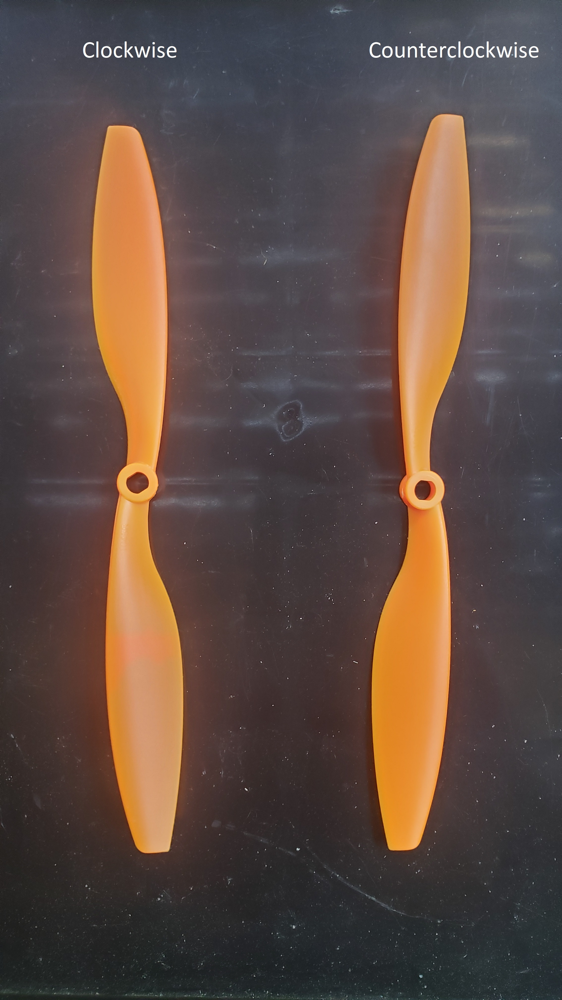

# Copter

### Propeller Direction of Rotation

Reference to a multi copter with propellers mounted above the motor - When looking from above a drone at your feet:  

Propellers |  Motor Order and Direction
:---------:|:-------------------------:
 |  

For quadcopters:
- A Reverse (R) propeller should rotate clockwise (pusher). 
- A Normal (N) propeller should rotate counterclockwise (tractor).  

The thicker-leading edge goes in the direction of rotation.

### Build Notes

- [Quadcopter Frame/Propeller/Motor Guide](./quad-frame-prop-motor-guide.md)

### Projects

- [UAVCAN with mRO Control Zero F7](./uavcan-control-zero.md)

