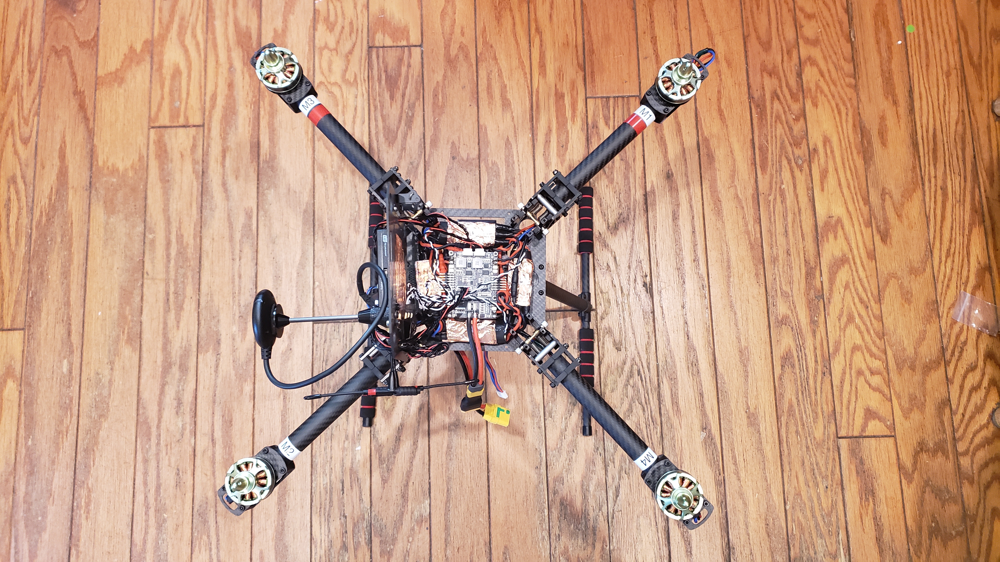
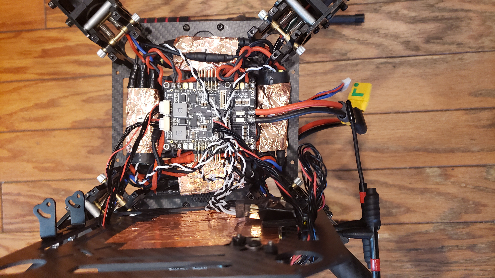
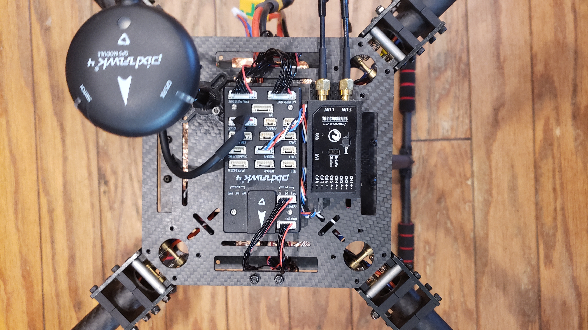

## ZD550 Build

- Last Updated: 5/16/2020

### Flash History

- Flashed ArduCopter V4.0.3 on 5/16/2020

### Components

- [USAQ 550mm Compact Folding Quadcopter Drone Frame Kit Full Carbon Fiber Construction](https://www.amazon.com/USAQ-Compact-Folding-Quadcopter-Construction/dp/B078MX6XQP)
  - Motor: 35-41 motor (recommended at least 3508 motor)
  - Prop: 12-15 inch CW CCW
  - ESC: 20-30A(2-6s) ; 40A (2-4S)
  - Battery: 2-6S Lipo
- [Holybro Pixhawk 4](http://www.holybro.com/product/pixhawk-4/)
- [Holybro Pixhawk 4 PM07](http://www.holybro.com/product/pixhawk-4-power-module-pm07/)
- [Holybro Pixhawk 4 GPS Module](http://www.holybro.com/product/pixhawk-4-gps-module/)
- [TBS Crossfire 8ch Diversity Receiver](https://www.team-blacksheep.com/products/prod:crossfire_8chrx)
- 4x [Turnigy Multistar 3508-580KV](https://hobbyking.com/en_us/3508-580kv-turnigy-multistar-14-pole-brushless-multi-rotor-motor-with-extra-long-leads.html)
  - KV(RPM/V): 580
  - Lipo cells: 3-4s
  - Max current: 340w
  - Max Amps: 26A
  - No Load Current: 0.4A/10v
  - Internal Resistance: .106ohm
  - Number of Poles: 14P12S (14poles 12 stators)
  - Dimensions(Dia.xL):42 x 26mm
  - Motor Shaft: 4mm
  - Prop Shaft: 6mm bolt on hub or 12mm hole to hole for bolt threw style props
  - Weight: 102g
  - Bolt hole spacing: 19mm * 25mm
- 4x [Readytosky 30A ESC Opto 2-6S Brushless Speed Controller for F450 S500 ZD550 RC Helicopter Quadcopter](https://www.amazon.com/gp/product/B07PZTB2MH/) **Requires Calibration - See below**

Total weight of copter without battery: 1430g

FPV:
- VTX 
- [SummitLink FPV 3 Channel Video Switch Module 3 way Video Switcher Unit for FPV cameras](https://www.amazon.com/gp/product/B00R5CJEY4)
- Runcam Swift 2

### Copter Configuration

#### Mission Planner Setup

### Model Configuration

Taranis X9D SE 2019 Configuration:
- SA is Flight Mode

### Wiring

  

### ESC Calibration

Perform ESC calibration

### Verification

### Flight Test

You can only arm or disarm in Stabilize, ACRO, AltHold, Loiter, and PosHold modes.

Arming motors: 
1. Press Arming Switch for 3 seconds
2. Throttle Down, Rudder Right for 5 seconds

Disarm motors: 
1. Throttle Down, Rudder left for 5 seconds

### Notes

- 12x4.5 vs 13x4.5 props.  12.5 will give longer flight time but 13x4.5 will give more thrust at sacrifice of flight time

### References

- [Ardupilot: ESC Calibration](https://ardupilot.org/copter/docs/esc-calibration.html)
- [Painless360: Multirotor build tips: Simple manual ESC calibration](https://www.youtube.com/watch?v=OOplk52R4no)
