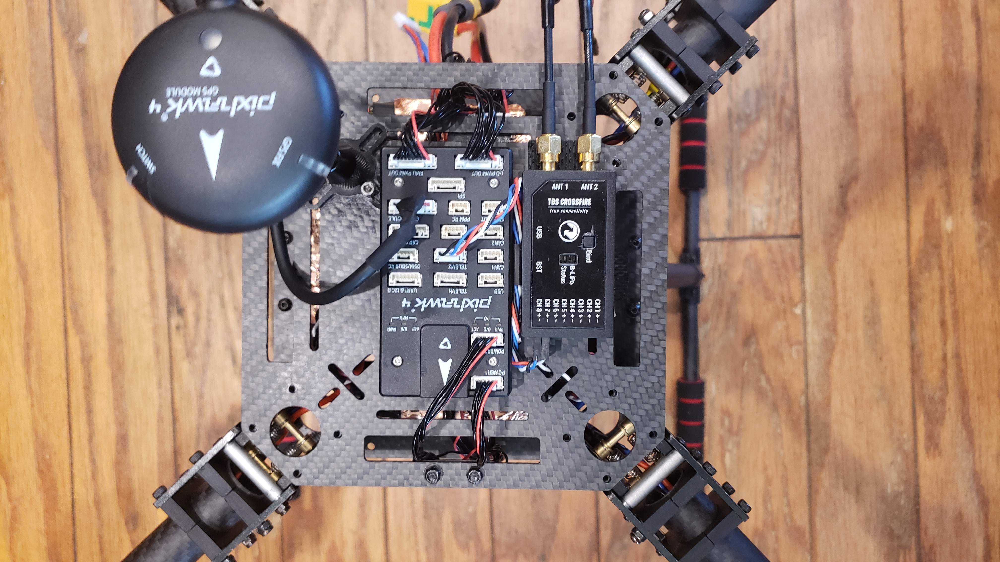

## ZD550 Build

### Summary

- [USAQ 550mm Compact Folding Quadcopter Drone Frame Kit Full Carbon Fiber Construction](https://www.amazon.com/USAQ-Compact-Folding-Quadcopter-Construction/dp/B078MX6XQP)
- [Holybro Pixhawk 4](http://www.holybro.com/product/pixhawk-4/)
- [Holybro Pixhawk 4 PM07](http://www.holybro.com/product/pixhawk-4-power-module-pm07/)
- [Holybro Pixhawk 4 GPS Module](http://www.holybro.com/product/pixhawk-4-gps-module/)
- [TBS Crossfire 8ch Diversity Receiver](https://www.team-blacksheep.com/products/prod:crossfire_8chrx)
- 4x [Turnigy Multistar 3508-580KV](https://hobbyking.com/en_us/3508-580kv-turnigy-multistar-14-pole-brushless-multi-rotor-motor-with-extra-long-leads.html)
- 4x [Readytosky 30A ESC Opto 2-6S Brushless Speed Controller for F450 S500 ZD550 RC Helicopter Quadcopter](https://www.amazon.com/gp/product/B07PZTB2MH/)

Total weight from above: 1430g

FPV:
- Crazepony FPV Transmitter Rush Tank 5.8GHz 48CH 0/25/200/500/800mW Switchable VTX Video Transmitter TBS SartAudio Inside MMCX Connector Pit Mode FPV Q 
- [SummitLink FPV 3 Channel Video Switch Module 3 way Video Switcher Unit for FPV cameras](https://www.amazon.com/gp/product/B00R5CJEY4)
- Runcam Swift 2

### Firmware

### Mission Planner

### Frame

 

Specifications:  

- Motor: 35-41 motor (recommended at least 3508 motor)
- Prop: 12-15 inch CW CCW
- ESC: 20-30A(2-6s) ; 40A (2-4S)
- Battery: 2-6S Lipo

### Wiring

  

### Receiver Setup

### Transmitter Setup

### Notes

