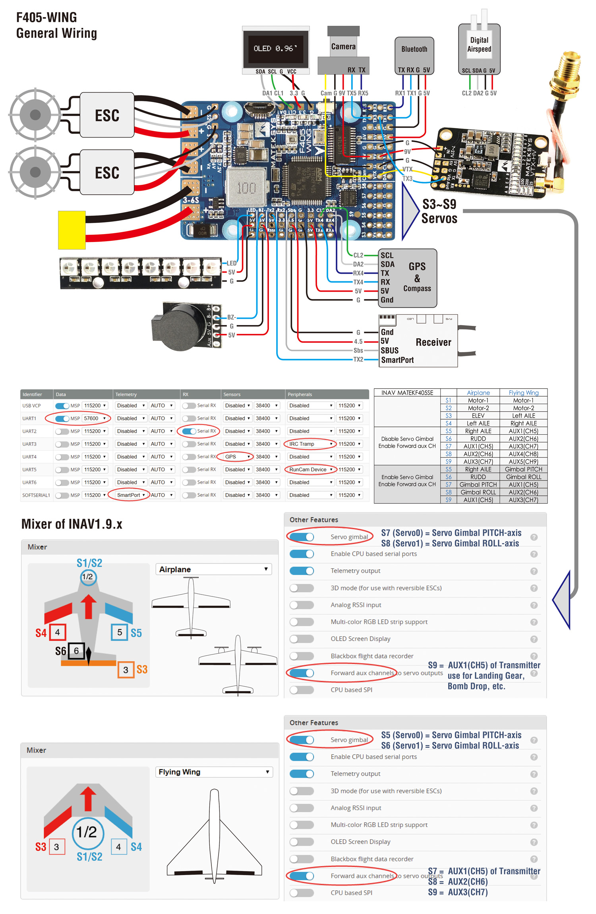

## Zohd Dart XL 

### Summary

- [Zohd Dart XL Extreme](https://www.getfpv.com/zohd-dart-xl-extreme-1000mm-wingspan-fpv-aircraft-rc-airplane-pnp.html)
- [Matek F405-WING Flight Controller](http://www.mateksys.com/?portfolio=f405-wing)
- AKK Infinite DVR VTX 25mW/200mW/600mW/1000mW MMCX Transmitter 
- Runcam Swift 2 600TVL FPV Camera Integrated OSD 2.3mm Lens
- [Matek SAM-M8Q Mini FPV GPS Module](http://www.mateksys.com/?portfolio=sam-m8q)

### Aircraft Specifications

- Brand Name: ZOHD
- Item Name: ZOHD Dart XL “Extreme”
- Material: Biodegradable BEPP
- Wingspan: 1000mm (39.37”)
- Length: 596mm (23.46”)
- Flying speed: 25-100+km/h
- Motor: 2216-1300KV
- ESC: 30A w/5V 3A BEC
- Servos: 9g Metal Gear Digital
- Prop: 9X4.5
- Recommended Battery: 4S 3300mAh
- Wing area: 19.8dm²
- Wing load: 60.6g/dm² (Max.)
- Recommended Max. Flying weight: 1200g
- Max. Flying time: 40 minutes (with recommended battery)

### Flash Firmware

Documentation: https://ardupilot.org/plane/docs/common-matekf405-wing.html  
Firmware: https://firmware.ardupilot.org/Plane/stable/MatekF405-Wing/  
- Flashed to Auduplane v4.0.3 on 02/02/2020 with Betaflight

- This application will attempt to install the correct serial port and DFU drivers for using STM32 F3 based flight controllers on Windows.: [ImpulseRC Driver Fixer program](https://impulserc.blob.core.windows.net/utilities/ImpulseRC_Driver_Fixer.exe)

### Mission Planner

Parameters: 

### Wiring

### Transmitter Setup

### References

- [Step By Step Guide | Arduplane/Chibios On Matek F405 Wing Board | Full Configuration & OSD | Omnibus](https://www.youtube.com/watch?v=kvI2Jp2JQs0)
- [Zohd Dart XL INAV FPV Upgrade - thingiverse](https://www.thingiverse.com/thing:3311328)
- [Oscar Liang Review](https://oscarliang.com/zohd-dart-xl/)

